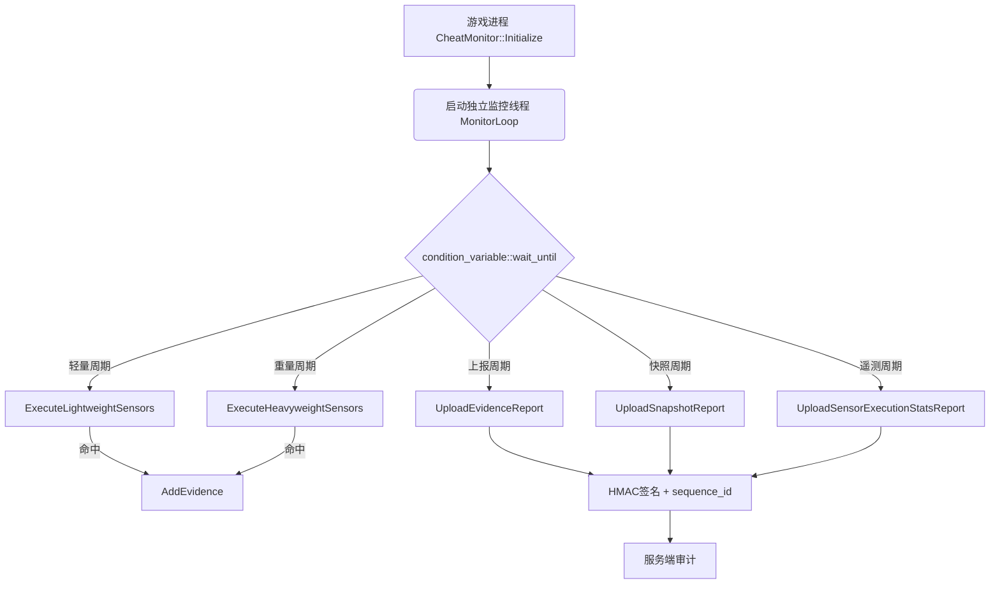
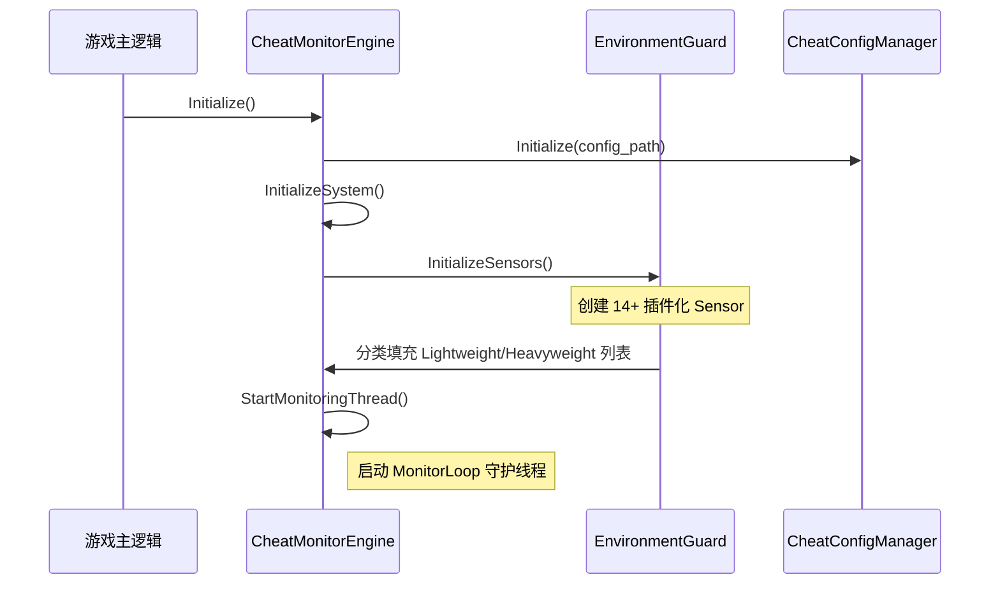
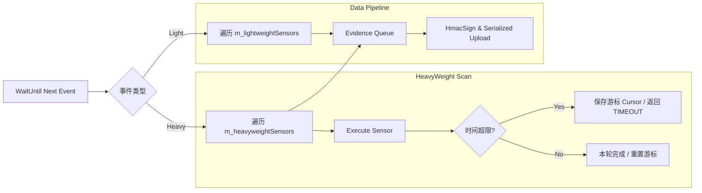
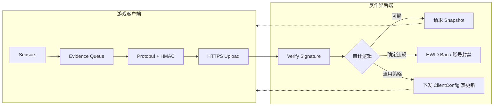

# AntiCheat
## 端游反外挂

**讲师**：williammuji
**关键词**：C++、Windows API 攻防、系统句柄监控、性能调优

---

# 概述

* **整体架构**：插件化Sensor。
* **检测实现**：14种核心检测 Sensor 的底层 C++ 原理与 API。
* **工程落地**：扫描高消耗与游戏帧率（FPS）之间的平衡取舍。
* **后台联动**：Protobuf 上报、HMAC 防篡改、Snapshot 离线审判、Telemetry 可观测性。

---

# 整体系统架构



---

# 初始化生命周期



---

# MonitorLoop：调度与心跳机制

- 主循环以 `condition_variable::wait_until` 阻塞，到期自动醒来。
- 完整运作时，周期性上传 `EvidenceReport`（这本身就是**心跳**）。
- **若客户端被恶意强杀**：服务端持续收不到心跳包 → 触发异常告警。

```cpp
while (m_isSystemActive.load()) {
    // 取五个定时器中最早到期的时间点，整合到一个 wait
    auto earliest = std::min({
        next_light_scan, next_heavy_scan,
        next_report_upload,       // 心跳 = 周期性证据上报
        next_sensor_stats_upload,
        next_snapshot_upload
    });
    m_cv.wait_until(lk, earliest,
        [&]() { return !m_isSystemActive.load(); });

    // 仅在玩家登录且已获取服务器配置后才开始扫描
    if (!m_isSessionActive || !m_hasServerConfig) continue;
    ...
}
```

---

# 扫描调度：分时切片与任务分发



---

# SensorRuntimeContext：共享状态与分片游标

- `context` 在每轮扫描中在所有 Sensor 之间共享缓存，避免重复系统调用。
- 游标字段跨轮持久化，支持超时后在下一轮接续扫描。

```cpp
// 跨扫描持久化游标（各 Sensor 独立）
size_t m_handleCursorOffset = 0;         // ProcessHandleSensor
size_t m_inlineHookModuleCursorOffset = 0;  // InlineHookSensor
size_t m_driverCursorOffset = 0;         // DriverIntegritySensor
size_t m_windowCursorOffset = 0;         // ProcessAndWindowMonitor

// 公共缓存（每轮重建一次，Sensor 只读）
std::vector<MEMORY_BASIC_INFORMATION> CachedMemoryRegions; // VirtualQuery 结果
std::vector<HMODULE>                 CachedModules;        // EnumProcessModules 结果

// 签名 LRU Cache（跨轮共享，避免高耗时 WinVerifyTrust 重复调用）
std::unordered_map<std::wstring,
    std::pair<SignatureVerdict, time_point>> m_moduleSignatureCache;
```

---

# ISensor 接口 与 执行框架

```cpp
class ISensor {
public:
    virtual const char* GetName() const = 0;
    // TIMEOUT 表示本轮预算耗尽，需挂起等待下轮接续
    virtual SensorExecutionResult Execute(SensorRuntimeContext& ctx) = 0;
    virtual anti_cheat::SensorFailureReason GetLastFailureReason() = 0;
};

// 统一执行包装：计时 + C++/SEH 异常捕获 + 指标上报
SensorExecutionResult ExecuteAndMonitorSensor(
    ISensor* sensor, SensorRuntimeContext& ctx, ...);

// 服务端可随时下发指令触发单次临时扫描
void SubmitTargetedScanRequest(const std::string& requestId,
                               const std::string& sensorName);
```

---

# 轻量 Sensor 1：AdvancedAntiDebugSensor

- 轻量级，每次轻扫均执行。
- 多层调试器检测：

| 检测方法 | API / 机制 |
|---------|-----------|
| Win32 API 探活 | `CheckRemoteDebuggerPresent` |
| PEB 标志位 | `__readgsqword(0x60) → BeingDebugged` |
| 堆标志位 | `ProcessHeap → Flags / ForceFlags` |
| 调试端口 | `NtQueryInformationProcess(7)` |
| 调试标志 | `NtQueryInformationProcess(0x1f)` |
| 内核调试器 | `NtQuerySystemInformation(35)` |
| 共享内存 | `KUSER_SHARED_DATA.KdDebuggerEnabled` |
| 硬件断点 | 检查线程 Context 中 DR0-DR3 寄存器 |

---

# 轻量 Sensor 2：SystemCodeIntegritySensor

- 查询系统代码完整性配置（开发者机器常见，正式游戏环境不该出现）。
- 也负责**反作弊自身完整性**检查。

```cpp
SYSTEM_CODE_INTEGRITY_INFORMATION sci = {sizeof(sci), 0};
NtQuerySystemInformation(SystemCodeIntegrityInformation, &sci, ...);

// Bit 0x02：测试签名模式开启 → 内核驱动可绕过签名验证
if (sci.CodeIntegrityOptions & 0x02)
    AddEvidence(ENVIRONMENT_SUSPICIOUS_DRIVER, "Test Signing Mode Enabled");

// Bit 0x01：内核调试模式
if (sci.CodeIntegrityOptions & 0x01 && CheckKernelDebuggerPresent())
    AddEvidence(ENVIRONMENT_DEBUGGER_DETECTED, "Kernel Debugging Enabled");

// 自我完整性：检查 IsAddressInLegitimateModule 函数前16字节是否被 Patch
context.CheckSelfIntegrity(); // 对比 InitializeSelfIntegrityBaseline() 时保存的快照
```

---

# 轻量 Sensor 3：VehHookSensor（1/2）

- **场景**：外挂注册高优先级 VEH 拦截程序执行流，优先级高于普通 SEH。
- **难点**：`LdrpVectorHandlerList` 是 `ntdll` 的内部全局变量，无导出符号。

```cpp
// 方法：以 ntdll 基址为起点做版本化特征偏移计算
uintptr_t ntdllBase = (uintptr_t)GetModuleHandleW(L"ntdll.dll");

// AccessVehStructSafe 封装不同 Windows 版本的偏移差异
VehAccessResult result = AccessVehStructSafe(ntdllBase, m_windowsVersion);
LIST_ENTRY* pHead = result.pHeadList;
```

---

# 轻量 Sensor 3：VehHookSensor（2/2）

```cpp
for (LIST_ENTRY* p = pHead->Flink; p != pHead; p = p->Flink) {
    // VEH 节点中的函数指针经过 EncodePointer 编码
    PVOID handlerAddr = DecodePointer(pNode->VectoredHandler);

    // 检查：是否落在某个已知合法签名模块内？
    std::wstring modulePath;
    if (!context.IsAddressInLegitimateModule(handlerAddr, modulePath)) {
        if (!IsInConfigWhitelist(modulePath))
            AddEvidence(INTEGRITY_API_HOOK, "VEH Hook @ " + hex(handlerAddr));
    }
}
```

---

# 轻量 Sensor 4：IatHookSensor

- 基线：进程启动时遍历导入表，记录每个 DLL 的所有函数指针序列的 FNV1a Hash。
- 校验：每轮对比当前 IAT 与基线（仅检查主模块），快速发现指针劫持。

```cpp
// 运行时校验（IatHookSensor::Execute）
// 重新遍历 IAT 计算当前 hash，与 baseline 对比
if (currentHash != baseline[dllName])
    AddEvidence(INTEGRITY_API_HOOK, "IAT Hook detected: " + dllName);
```

---

# 轻量 Sensor 5：InlineHookSensor

- 检查系统关键 API（`ntdll` / `kernel32`）入口是否被改写为跳转指令。

```cpp
hde32s hs;
hde32_disasm(pFunc, &hs);   // 使用反汇编引擎

// 外挂常见特征：E9 (JMP rel32) 或 EB (JMP rel8)
if (hs.opcode == 0xE9 || hs.opcode == 0xEB) {
    PVOID target = CalculateTarget(pFunc, hs);
    if (!IsAddressInLegitimateModule(target))
        AddEvidence(INTEGRITY_SYSTEM_API_HOOKED, "Inline Hook: " + funcName);
}
```

- 补充：引擎还通过 **`LdrRegisterDllNotification`** 实现实时 DLL 加载回调，无需等待下一轮扫描。

---

# 轻量 Sensor 6：ProcessHollowingSensor

- 检测进程镂空（Process Hollowing）：宿主进程内存被替换为恶意代码。

```cpp
// 关键：对比内存与磁盘中的 PE Header
bool entryMismatch = pMemNt->OptionalHeader.AddressOfEntryPoint
                  != pDiskNt->OptionalHeader.AddressOfEntryPoint;
bool sizeMismatch  = pMemNt->OptionalHeader.SizeOfImage
                  != pDiskNt->OptionalHeader.SizeOfImage;

// 二次确认：入口页内存类型是否正常（合法映像应为 MEM_IMAGE）
VirtualQuery(entryAddress, &entryMbi, sizeof(entryMbi));
bool entryPageAnomaly = (entryMbi.Type != MEM_IMAGE)
    || (entryMbi.Protect & PAGE_EXECUTE_READWRITE);

if ((entryMismatch && sizeMismatch) || (entryMismatch && entryPageAnomaly))
    AddEvidence(INTEGRITY_PROCESS_HOLLOWED, ...);
```

---

# 轻量 Sensor 7：VTableHookSensor

- **场景**：劫持渲染接口虚函数表（如 D3D9/DXGI）以在游戏画面上实现透视叠加（ESP）。
- **检测逻辑**：对比游戏运行时的对象虚表指针与已知合法模块的基线。

```cpp
// 1. 获取渲染对象指针 (例如通过虚钩子劫持其创建过程)
IDirect3DDevice9* pDevice = GetCurrentD3DDevice();

// 2. 访问虚函数表并依次比对
PVOID* vtable = *(PVOID**)pDevice;
for (int i = 0; i < kD3D9_VTable_Count; i++) {
    PVOID funcAddr = vtable[i];

    // 溯源：检查该函数地址是否落入非 D3D9.dll/DXGI.dll 的未知区域
    std::wstring modulePath;
    if (!context.IsAddressInLegitimateModule(funcAddr, modulePath)) {
        // 发现被非法劫持
        AddEvidence(INTEGRITY_API_HOOK, "D3D9 VTable[" + i + "] Hooked by " + modulePath);
    }
}
```

---

# 重量级传感器 (Heavyweight Sensors)

### 核心特性
- **高开销、深颗粒度**：涉及全内存扫描、系统句柄表枚举、多模块代码 Hash。
- **调度机制**：长周期执行，严格遵守 `budget_ms` 时间切片。
- **状态持久化**：使用 `SensorRuntimeContext` 中的游标实现跨轮扫描。

---

# 重量 Sensor 1：ProcessAndWindowMonitorSensor

- 扫描所有可见窗口标题和进程名，与黑名单匹配。

```cpp
// 分片处理 windows + processes，超时立即挂起保存游标
while (cursor < totalItems) {
    CheckWindow(...) / CheckProcess(...);
    cursor++;
    if (elapsed > budget_ms) {
        context.SetWindowCursorOffset(cursor);
        return TIMEOUT;   // 下轮从 cursor 继续
    }
}
```


---

# 重量 Sensor 2：ProcessHandleSensor（1/3）

- **场景**：外部读写分离外挂以独立进程运行，通过 `OpenProcess` 拿到高权限句柄。
- 调用未文档化 API 一次性拿到系统全量句柄表，然后逐项过滤。

```cpp
// 优先使用扩展结构（Win7+），失败则回退旧版
status = NtQuerySystemInformation(
    SystemExtendedHandleInformation,  // 包含 UniqueProcessId 字段
    buffer, bufferSize, nullptr);

if (status == STATUS_INFO_LENGTH_MISMATCH) {
    buffer = Resize(buffer, bufferSize * 2);  // 缓冲区不足时倍增
    // 扩容有上限（GetMaxBufferSizeMb），超限直接 FAILURE
}

// 快速过滤：只关注有内存读写权限的句柄
bool HasSuspiciousAccessMask(ULONG granted) {
    return (granted & (PROCESS_VM_READ | PROCESS_VM_WRITE
                                       | PROCESS_VM_OPERATION)) != 0;
}
```

---

# 重量 Sensor 2：ProcessHandleSensor（2/3）

- 光有权限位不够。需要精确确认"这个句柄是否真的指向我们自己的进程"。

```cpp
// 将外部进程的句柄复制到本进程，再查其目标 PID
HANDLE hDup;
HANDLE hSourceProc = OpenProcess(PROCESS_DUP_HANDLE, FALSE, ownerPid);
DuplicateHandle(hSourceProc, remoteHandleValue,
                GetCurrentProcess(), &hDup,
                PROCESS_QUERY_INFORMATION, FALSE, 0);

DWORD targetPid = GetProcessId(hDup);
if (targetPid == ownPid) {
    // 确认该外部进程持有我们进程的高权限句柄
    // 下一步：获取对方进程路径，做签名验证
    std::wstring path = Utils::GetProcessFullName(hOwnerProcess);
    Utils::SignatureStatus sig = Utils::VerifyFileSignature(path);
    if (sig != TRUSTED)
        AddEvidence(INTEGRITY_SUSPICIOUS_HANDLE, path + " PID=" + ownerPid);
}
```

---

# 重量 Sensor 2：ProcessHandleSensor（3/3）

- 系统句柄数可达数万，签名校验（`WinVerifyTrust`）单次耗时百毫秒级。

```cpp
// 游标分片：从上次中断位置继续
ULONG_PTR cursorStart = context.GetHandleCursorOffset() % total;

for (ULONG_PTR step = 0; step < total; ++step) {
    if (step % 200 == 0 && elapsed > budget_ms) {
        context.SetHandleCursorOffset(cursorStart + step);
        return TIMEOUT;   // 让出 CPU，下一轮接续
    }
}

// PID 节流：同一可疑 PID 确认后，冷却 N 分钟再查
pidTtlMap[ownerPid] = now + minutes(GetPidThrottleMinutes());

// 签名结果 LRU Cache：同路径进程不重复调用 WinVerifyTrust
processSigCache[path] = {signatureStatus, now};
```

---

# 重量 Sensor 3：MemorySecuritySensor（1/3）

- **场景**：Fileless 注入——Shellcode 直接写入游戏进程的私有内存执行，没有对应 DLL 文件。

```cpp
// CachedMemoryRegions 由 context 维护，避免每个 Sensor 重复调 VirtualQuery
for (const auto& mbi : context.CachedMemoryRegions) {
    if (mbi.State != MEM_COMMIT) continue;

    const bool isExec = mbi.Protect &
        (PAGE_EXECUTE | PAGE_EXECUTE_READ
         | PAGE_EXECUTE_READWRITE | PAGE_EXECUTE_WRITECOPY);
    if (!isExec) continue;

    // 先做模块归属检查
    HMODULE hMod;
    bool inModule = GetModuleHandleExW(
        GET_MODULE_HANDLE_EX_FLAG_FROM_ADDRESS|..., addr, &hMod);

    // 不属于任何模块 → 进入深度检测
    if (!inModule)  DetectPrivateExecutableMemory / DetectHiddenModule / DetectMappedExecutableMemory
}
```

---

# 重量 Sensor 3：MemorySecuritySensor（2/3）

- **核心矛盾**：.NET JIT / 显卡 Shader 编译器 / 覆盖层软件（Steam/Discord）都会分配私有可执行内存。

```cpp
const bool isRWX   = mbi.Protect & PAGE_EXECUTE_READWRITE
                   || mbi.Protect & PAGE_EXECUTE_WRITECOPY;
const bool isRXOnly = (mbi.Protect & PAGE_EXECUTE_READ) && !isRWX;

// 策略 1：RX-only 全部跳过（JIT 合法特征），只追 RWX
if (isRXOnly) continue;

// 策略 2：低地址(<2MB) 小块(<64KB) RWX → 系统 trampoline，跳过
if (base < 0x200000 && regionSize < 64*1024) continue;

// 策略 3：初始分配属性本就含执行权限 → 合法 JIT，跳过
if (mbi.AllocationProtect &
    (PAGE_EXECUTE | PAGE_EXECUTE_READ | PAGE_EXECUTE_READWRITE)) continue;

// 策略 4：二次确认才上报（是否有线程以此为起点？模块签名是否异常？）
if (!HasSecondaryConfirmation(context, mbi)) continue;
```

---

# 重量 Sensor 3：MemorySecuritySensor（3/3）

- 手动映射（Manual Map）外挂会保留 PE 结构但擦除文件名，需暴力扫内存识别。

```cpp
// 读取区域前 1024 字节尝试解析 MZ + NT 头
std::vector<BYTE> buf(1024);
ReadProcessMemory(GetCurrentProcess(), baseAddr, buf.data(), 1024, &read);

PIMAGE_DOS_HEADER pDos = (PIMAGE_DOS_HEADER)buf.data();
bool hasMZ = (pDos->e_magic == IMAGE_DOS_SIGNATURE);  // 0x5A4D 'MZ'

// 容忍 DOS Header 被抹除：按 4 字节步长扫 NT Signature (0x00004550 'PE')
for (size_t i = 0; i < read - sizeof(IMAGE_NT_HEADERS); i += 4) {
    auto* pNt = (PIMAGE_NT_HEADERS)(buf.data() + i);
    if (pNt->Signature == IMAGE_NT_SIGNATURE
        && pNt->FileHeader.Machine == IMAGE_FILE_MACHINE_AMD64) {
        // 找到隐藏 PE → 上报 MODULE_UNTRUSTED_DYNAMIC_LOAD
    }
}
```

---

# 重量 Sensor 4：ModuleActivitySensor

- **基线审计**：启动时对已加载 DLL 进行签名快照，后续严密监控动态注入。
- **降噪机制**：对系统白名单路径（System32/WinSxS）且有正规签名的 DLL 实施豁免。

```cpp
// 1. 获取当前进程全部模块快照 (EnumProcessModules)
std::vector<HMODULE> currentModules = SystemUtils::GetProcessModules(ownProcess);

for (auto hMod : currentModules) {
    if (context.IsModuleKnown(hMod)) continue;  // 命中基线缓存则跳过

    wchar_t path[MAX_PATH];
    GetModuleFileNameW(hMod, path, MAX_PATH);

    // 2. 深度验证：签名链 -> 吊销列表 -> 云端白名单
    auto verdict = Utils::ValidateModule(path, osVersion);
    if (!verdict.isTrusted) {
        // 识别注入：上报 RUNTIME_MODULE_NEW_UNKNOWN
        AddEvidence(RUNTIME_MODULE_NEW_UNKNOWN, "注入模块: " + path);
    } else {
        context.InsertKnownModule(hMod); // 加入动态基线
    }
}
```

---

# 重量 Sensor 5：DriverIntegritySensor

- **全量内核审计**：监控系统所有已加载驱动，防范手动映射的恶意驱动 (DKOM/Manual Map)。

```cpp
// 游标持久化扫描，防止 EnumDeviceDrivers 瞬间压力
for (int i = context.GetDriverCursor(); i < totalCount; ++i) {
    if (IsTimeBudgetExceeded()) {
        context.SetDriverCursor(i); return TIMEOUT;
    }

    WCHAR szDriver[MAX_PATH];
    GetDeviceDriverFileNameW(drivers[i], szDriver, MAX_PATH);

    // 内核路径转换: \Device\HarddiskVolume... -> C:\...
    std::wstring winPath = SystemUtils::NormalizeKernelPath(szDriver);

    // 校验驱动签名完整性
    if (!Utils::VerifyFileSignature(winPath).isTrusted) {
        AddEvidence(ENVIRONMENT_SUSPICIOUS_DRIVER, "可疑驱动: " + winPath);
    }
}
```

---

# 重量 Sensor 6：ThreadActivitySensor

- **幽灵线程追踪**：查询线程在内核中的真实地址，识别无文件关联的异常执行流。

```cpp
// 利用未导出类查询线程起始地址 (ThreadQuerySetWin32StartAddress)
PVOID startAddress = nullptr;
NtQueryInformationThread(hThread, (THREADINFOCLASS)9, &startAddress, ...);

// 溯源：该地址是否落在任何合法、已签名的模块内存空间内？
if (!context.IsAddressInLegitimateModule(startAddress)) {
    // 若在 MEM_PRIVATE 或 MEM_FREE 空间执行 -> 极大概率为 Shellcode 线程
    AddEvidence(RUNTIME_THREAD_NEW_UNKNOWN, "未知起点线程: " + hex(startAddress));
}

// 辅助检测：检查线程上下文中的硬件调试寄存器 (Anti-HWBP)
GetThreadContext(hThread, &threadCtx);
if (threadCtx.Dr0 || threadCtx.Dr1 || threadCtx.Dr2 || threadCtx.Dr3) {
    AddEvidence(ENVIRONMENT_DEBUGGER_DETECTED, "检测到硬件断点");
}
```

---

# 重量 Sensor 7：ModuleIntegritySensor

- **全量代码校验**：对反作弊自身及系统关键 DLL 进行代码段 Hash 巡检，严堵内存补丁。

```cpp
// 1. 定位 .text 节地址与大小
PVOID codeBase; DWORD codeSize;
SystemUtils::GetModuleCodeSectionInfo(hMod, codeBase, codeSize);

// 2. FNV1a 哈希滚动校验：对比基线值
auto currentHash = CryptoUtils::CalculateFnv1a(codeBase, codeSize);
if (currentHash != m_moduleBaselineHashes[modPath]) {
    // 发现内存 Patch：上报 INTEGRITY_MODULE_TAMPERED
    AddEvidence(INTEGRITY_MODULE_TAMPERED, "代码段篡改: " + modPath);
}

// 3. 自我防御：校验 ISensor::Execute 等引擎核心入口前 16 字节
// 旨在对抗旨在使检测函数直接 return 的“逻辑绕过型”Patch
if (memcmp(currentPtr, m_selfBaseline, 16) != 0) {
    AddEvidence(INTEGRITY_SELF_TAMPERING, "反作弊引擎被 Patch");
}
```

---

# 上报协议：HMAC 防篡改与 sequence_id 防重放

- 外挂可能尝试截包重放合法报文，或修改报文内容以规避服务端检测。

```cpp
void CheatMonitorEngine::SendReport(const anti_cheat::Report& report) {
    anti_cheat::Report signed_report = report;

    // 自增序号：服务端拒绝已见过的序号
    signed_report.set_sequence_id(++m_sequenceId);
    // 每次游戏启动生成新 UUID，防跨会话重放
    signed_report.set_session_id(m_sessionId);
    // 客户端时间戳，配合服务端时钟窗口校验
    signed_report.set_timestamp_ms(now_ms());

    // HMAC-SHA256：密钥由服务端通过 ClientConfig 下发
    std::string hmac_key = CheatConfigManager::GetHmacKey();
    std::string sig = CryptoUtils::CalculateHMAC_SHA256(payload, hmac_key);
    signed_report.set_signature(sig);

    // 发送前序列化
    signed_report.SerializeToString(&upload_payload);
    // HttpSend(server_url, upload_payload);
}
```

---

# SnapshotReport：取证快照与云端离线审判

- 遇到不确定的可疑状态时，拍下"案发现场"交由服务端离线判定，避免客户端误封。

```cpp
// 采集所有线程快照（每个线程的起点地址、内存类型、关联模块路径）
std::vector<ThreadSnapshot> threads = CollectThreadSnapshots();
// 采集所有模块快照（路径、基址、PE时间戳、证书指纹、代码节SHA-256）
std::vector<ModuleSnapshot> modules = CollectModuleSnapshots();
```

**服务端可以做的事情**：
- 对比多个玩家的模块快照，发现大面积异常（相同代码节 hash 不一致）。
- 关联同一玩家多次快照的 thread start_address，追踪幽灵线程生命周期。
- 用历史正常快照作为基准，对当前快照做统计离群检测。

---

# Telemetry：Sensor 执行指标可观测性

- 为每个 Sensor 单独采集执行统计，定期上报服务端用于调参和告警。

```cpp
// 每个 Sensor 执行后记录到 m_sensorExecutionStats[name]
struct SensorExecutionStats {
    uint32 success_count;             // 成功次数
    uint32 failure_count;             // 失败次数
    uint32 timeout_count;             // 超时次数（未完整扫描）
    uint32 avg_success_time_ms;       // 平均耗时
    uint32 max_success_time_ms;       // 最大耗时（排查卡顿用）
    map<int32, uint32> failure_reasons; // 每种失败原因的计数
    // 工作量计数（配合调参）
    uint64 workload_last_snapshot_size; // 本轮扫描快照大小（句柄数/模块数）
    uint64 workload_last_attempts;      // 本轮实际处理数量
    uint64 workload_last_hits;          // 本轮命中可疑目标数量
}
```

- **实际用途**：通过 `timeout_count / success_count` 比例判断某 Sensor 是否普遍卡顿，进而调整 `heavy_scan_budget_ms` 或 `max_handle_scan_count` 等配置。

---

# 单次按需扫描 (Targeted Scan)

- **场景**：服务端风控系统发现异常（或玩家被举报），需立即发起定向深度复查。
- **实现**：服务端下发 `TargetedSensorCommand`，客户端调度器优先插队执行并立即上报。

```cpp
// 接收服务端指令压入队列
void CheatMonitorEngine::SubmitTargetedScanRequest(
    const std::string &requestId, const std::string &sensorName) {
    std::lock_guard<std::mutex> lock(m_targetedScanMutex);
    m_targetedScanQueue.push_back({requestId, sensorName});
}

// 调度器 (MonitorLoop) 会优先提取并处理该队列，并同步执行相应的传感器
TargetedScanRequest req = m_targetedScanQueue.front();
ISensor* sensor = m_sensorRegistry[req.sensorName];
SensorExecutionResult result = ExecuteAndMonitorSensor(sensor, ...);

// 执行结束后马上构建并发送 TargetedSensorReport，完成一次云端联动的按需检测
UploadTargetedSensorReport(req.requestId, req.sensorName, result, ...);
```

---

# 进程加固与环境防御 (Process Hardening)

- **场景**：防止外挂轻易修改反作弊代码本身，提升对抗门槛（防注入、防挂载）。
- **做法**：利用 Windows 自带的进程缓解策略 (Process Mitigation Policies)。

```cpp
void CheatMonitorEngine::HardenProcessAndThreads() {
    // 1. 拦截未签名 DLL 加载 (仅允许微软/WHQL等合法签名注入)
    SetProcessMitigationPolicy(ProcessSignaturePolicy, &sigPolicy, ...);

    // 2. 启用 DEP (数据执行保护)，封堵简单的缓冲区溢出直接执行代码
    SetProcessMitigationPolicy(ProcessDEPPolicy, &depPolicy, ...);

    // 3. 禁止子进程创建，防止进程链被利用(如继承句柄)
    SetProcessMitigationPolicy(ProcessChildProcessPolicy, &childPolicy, ...);

    // 4. 将反作弊核心监控线程从调试器事件中隐藏 (反调试增强)
    NtSetInformationThread(GetCurrentThread(), ThreadHideFromDebugger, ...);
}
```

---

# 硬件特征采集 (Hardware Collection)

- **场景**：除账号封禁外，对恶劣外挂工作室实施机器级别的物理封禁 (HWID Ban)。
- **做法**：游戏初始化早期采集多种硬件指纹。

```cpp
// 通过底层 API 或 WMI 获取设备序列号和网卡信息
GetVolumeInformationW(L"C:\\", ... &volumeSerialNumber ...);
GetAdaptersInfo(pAdapterInfo, &ulOutBufLen);

// 通过 CPUID 指令提取处理器核心特征
__cpuid(cpui, 0);

// 在登录时统一包装为 HardwareReport 并上报服务端
void CheatMonitorEngine::UploadHardwareReport() {
    auto hardware_report = report.mutable_hardware();
    hardware_report->set_disk_serial(m_hwCollector->GetDiskSerial());
    hardware_report->set_computer_name(m_hwCollector->GetComputerName());
    for (const auto& mac : m_hwCollector->GetMacAddresses())
        hardware_report->add_mac_addresses(mac);
    // ...
}
```

---

# 策略热更新 (Config Hot Update)

- **场景**：防御与外挂是一个动态博弈，需紧急屏蔽外挂特征、下发豁免白名单或调整性能门槛，而不能等待游戏大版本更新。
- **做法**：全量控制参数通过 protobuf `ClientConfig` 数据结构动态覆盖生效。

```cpp
void CheatConfigManager::UpdateConfigFromServer(const std::string& server_data) {
    auto new_config_data = std::make_shared<ConfigData>();

    anti_cheat::ClientConfig server_config;
    if (server_config.ParseFromString(server_data)) {
        // 利用 Protobuf 原生机制合并并覆盖默认值
        new_config_data->config->MergeFrom(server_config);
    }

    // 原子指针切换，保证业务层读无锁低耗
    std::lock_guard<std::mutex> lock(m_mutex);
    m_configData = std::move(new_config_data);

    // 触发引擎回调
    CheatMonitor::GetInstance().OnServerConfigUpdated();
}
```

---

# 数字化证据与取证审计



---

# 总结

- **无法一劳永逸**
  - 没有绝对安全的客户端，防线的作用是不断拉高黑产的开发门槛与维护成本。
- **性能是安全的前提**
  - 多用分时切片、大内存对象池与 LRU Cache。
- **决策在后端**
  - 客户端取证，后端决策。搭配收集上下文进行长线数据分析。

---

# Q & A
