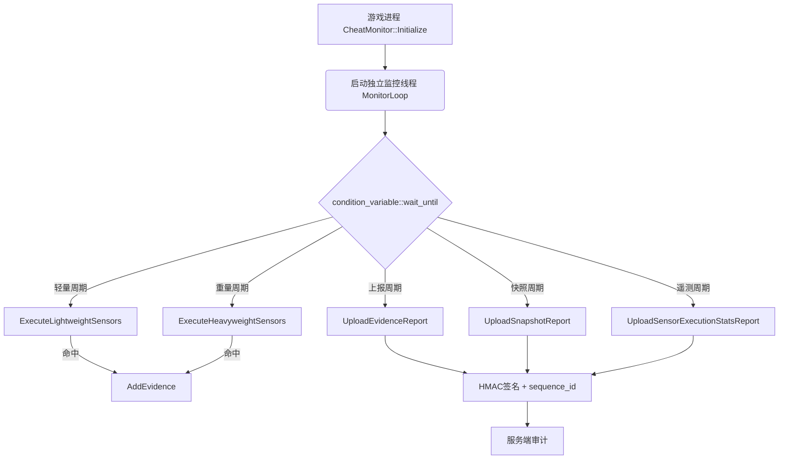
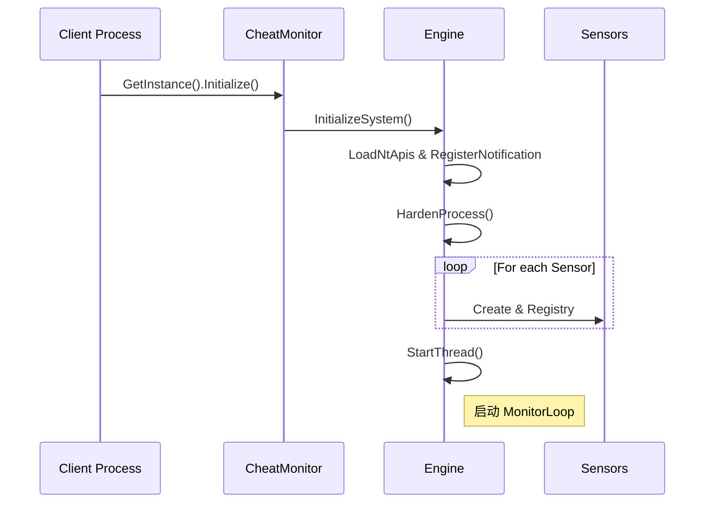
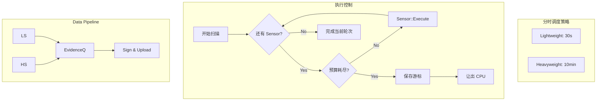
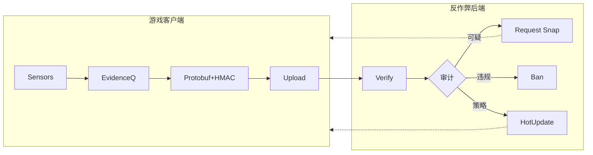

<style>
section {
  display: flex !important;
  flex-direction: column !important;
  justify-content: flex-start !important;
  align-items: stretch !important;
  padding-top: 40px !important;
  padding-left: 50px !important;
  padding-right: 50px !important;
}
h1 {
  margin-top: 0 !important;
  margin-bottom: 20px !important;
  text-align: left !important;
}
section.center-content h1 {
  position: absolute !important;
  top: 40px !important;
  left: 50px !important;
  right: 50px !important;
}
img {
  display: block;
  margin: 10px auto !important;
}
code {
  font-size: 0.65em !important;
}
pre {
  margin-top: 5px !important;
  margin-bottom: 5px !important;
}
p, li {
  margin-top: 2px !important;
  margin-bottom: 2px !important;
}
section.title-page {
  justify-content: center !important;
  align-items: center !important;
  text-align: center !important;
  padding-top: 0 !important;
}
section.title-page h1 {
  text-align: center !important;
  margin-bottom: 40px !important;
}
section.center-content {
  justify-content: center !important;
}
</style>

<!-- _class: title-page -->

# AntiCheat

## williammuji

---

# 概述

* **模块化设计**：传感器独立检测。
* **检测实现**：14 种核心检测 Sensor 原理。
* **分时调度**：扫描高消耗与游戏帧率（FPS）之间的平衡取舍。
* **后台联动**：Protobuf 上报、HMAC 防篡改、Snapshot 审核。

---

# 整体系统架构



---

# 初始化生命周期



---

# MonitorLoop：调度与心跳机制（1/2）

- 主循环以 `condition_variable::wait_until` 阻塞，到期自动醒来。
- 若客户端被恶意强杀，服务端持续收不到心跳包 → 触发异常告警。

```cpp
while (m_isSystemActive.load()) {
    auto earliest = std::min({
        next_light_scan, next_heavy_scan, next_report_upload,
        next_sensor_stats_upload, next_snapshot_upload, next_heartbeat_upload
    });
    m_cv.wait_until(lk, earliest, [&]() { return !m_isSystemActive.load(); });
```

---

# MonitorLoop：调度与心跳机制（2/2）

- 仅在玩家登录且已获取服务器配置后才开始扫描。

```cpp
    if (!m_isSystemActive.load()) break;
    if (!m_isSessionActive || !m_hasServerConfig) continue;

    const auto now = std::chrono::steady_clock::now();
    if (now >= next_light_scan) {
        ExecuteLightweightSensors();
        next_light_scan = now + GetLightScanInterval();
    }
    // ... 其他定时任务逻辑
}
```

---

<!-- _class: center-content -->

# 扫描调度：分时切片与任务分发



---

# SensorRuntimeContext：共享状态与分片游标

- `context` 在每轮扫描中在所有 Sensor 之间共享缓存，避免重复系统调用。
- 游标字段支持超时后在下一轮接续扫描。

```cpp
// 跨扫描持久化游标（各 Sensor 独立）
size_t m_handleCursorOffset = 0;         // ProcessHandleSensor
size_t m_inlineHookModuleCursorOffset = 0;  // InlineHookSensor
size_t m_driverCursorOffset = 0;         // DriverIntegritySensor
size_t m_windowCursorOffset = 0;         // ProcessAndWindowMonitor

// 公共缓存（每轮重建一次，Sensor 只读）
std::vector<MEMORY_BASIC_INFORMATION> CachedMemoryRegions; // VirtualQuery 结果
std::vector<HMODULE>                 CachedModules;        // EnumProcessModules 结果

// 签名 LRU Cache（跨轮共享，避免高耗时 WinVerifyTrust 重复调用）
std::unordered_map<std::wstring,
    std::pair<SignatureVerdict, time_point>> m_moduleSignatureCache;
```

---

# ISensor 接口与执行框架

```cpp
class ISensor {
public:
    virtual const char* GetName() const = 0;
    // TIMEOUT 表示本轮预算耗尽，需挂起等待下轮接续
    virtual SensorExecutionResult Execute(SensorRuntimeContext& ctx) = 0;
    virtual anti_cheat::SensorFailureReason GetLastFailureReason() = 0;
};

// 统一执行包装：计时 + C++/SEH 异常捕获 + 指标上报
SensorExecutionResult ExecuteAndMonitorSensor(
    ISensor* sensor, SensorRuntimeContext& ctx, ...);

// 服务端可随时下发指令触发单次临时扫描
void SubmitTargetedScanRequest(const std::string& requestId,
                               const std::string& sensorName);
```

---

# Light Sensor 1：AdvancedAntiDebugSensor

- 轻量级，每次轻扫均执行。
- 多层调试器检测：

| 检测方法 | API / 机制 |
|---------|-----------|
| Win32 API 探活 | `CheckRemoteDebuggerPresent` |
| PEB 标志位 | `__readgsqword(0x60) → BeingDebugged` |
| 堆标志位 | `ProcessHeap → Flags / ForceFlags` |
| 调试端口 | `NtQueryInformationProcess(7)` |
| 调试标志 | `NtQueryInformationProcess(0x1f)` |
| 内核调试器 | `NtQuerySystemInformation(35)` |
| 共享内存 | `KUSER_SHARED_DATA.KdDebuggerEnabled` |
| 硬件断点 | 检查线程 Context 中 DR0-DR3 寄存器 |

---

# Light Sensor 2：SystemCodeIntegritySensor（1/2）

- **查询系统代码完整性配置**（测试签名模式/内核调试）。

```cpp
SYSTEM_CODE_INTEGRITY_INFORMATION sci = {sizeof(sci), 0};
NtQuerySystemInformation(SystemCodeIntegrityInformation, &sci, ...);

if (sci.CodeIntegrityOptions & 0x02)
    AddEvidence(ENVIRONMENT_SUSPICIOUS_DRIVER, "Test Signing Mode Enabled");
if (sci.CodeIntegrityOptions & 0x01 && CheckKernelDebuggerPresent())
    AddEvidence(ENVIRONMENT_DEBUGGER_DETECTED, "Kernel Debugging Enabled");
```

---

# Light Sensor 2：SystemCodeIntegritySensor（2/2）

- **反作弊自身完整性检查**：对比函数快照。

```cpp
// 检查 IsAddressInLegitimateModule 等核心函数是否被 Patch
context.CheckSelfIntegrity(); // 对比 InitializeSelfIntegrityBaseline() 时保存的快照
```

---

# Light Sensor 3：VehHookSensor（1/2）

- **场景**：外挂注册高优先级 VEH 拦截程序执行流，优先级高于普通 SEH。
- **难点**：`LdrpVectorHandlerList` 是 `ntdll` 的内部全局变量，无导出符号。

```cpp
// 方法：以 ntdll 基址为起点做版本化特征偏移计算
uintptr_t ntdllBase = (uintptr_t)GetModuleHandleW(L"ntdll.dll");

// AccessVehStructSafe 封装 different Windows 版本的偏移差异
VehAccessResult result = AccessVehStructSafe(ntdllBase, m_windowsVersion);
LIST_ENTRY* pHead = result.pHeadList;
```

---

# Light Sensor 3：VehHookSensor（2/2）

```cpp
for (LIST_ENTRY* p = pHead->Flink; p != pHead; p = p->Flink) {
    // VEH 节点中的函数指针经过 EncodePointer 编码
    PVOID handlerAddr = DecodePointer(pNode->VectoredHandler);

    // 检查：是否落在某个已知合法签名模块内？
    std::wstring modulePath;
    if (!context.IsAddressInLegitimateModule(handlerAddr, modulePath)) {
        if (!IsInConfigWhitelist(modulePath))
            AddEvidence(INTEGRITY_API_HOOK, "VEH Hook @ " + hex(handlerAddr));
    }
}
```

---

# Light Sensor 4：IatHookSensor

- 基线：进程启动时遍历导入表，记录每个 DLL 的所有函数指针序列的 FNV1a Hash。
- 校验：每轮对比当前 IAT 与基线（仅检查主模块），快速发现指针劫持。

```cpp
// 运行时校验（IatHookSensor::Execute）
// 重新遍历 IAT 计算当前 hash，与 baseline 对比
if (currentHash != baseline[dllName])
    AddEvidence(INTEGRITY_API_HOOK, "IAT Hook detected: " + dllName);
```

---

# Light Sensor 5：InlineHookSensor

- 检查系统关键 API（`ntdll` / `kernel32`）入口是否被改写为跳转指令。
- `LdrRegisterDllNotification` 实现实时 DLL 加载回调，无需等待下一轮扫描。

```cpp
hde32s hs;
hde32_disasm(pFunc, &hs);   // 使用反汇编引擎

// 外挂常见特征：E9 (JMP rel32) 或 EB (JMP rel8)
if (hs.opcode == 0xE9 || hs.opcode == 0xEB) {
    PVOID target = CalculateTarget(pFunc, hs);
    if (!IsAddressInLegitimateModule(target))
        AddEvidence(INTEGRITY_SYSTEM_API_HOOKED, "Inline Hook: " + funcName);
}
```

---

# Light Sensor 6：ProcessHollowingSensor

- 检查宿主进程入口点与磁盘文件是否一致。

```cpp
bool entryMismatch = pMemNt->OptionalHeader.AddressOfEntryPoint
                  != pDiskNt->OptionalHeader.AddressOfEntryPoint;
bool sizeMismatch  = pMemNt->OptionalHeader.SizeOfImage
                  != pDiskNt->OptionalHeader.SizeOfImage;

VirtualQuery(entryAddress, &entryMbi, sizeof(entryMbi));
bool entryPageAnomaly = (entryMbi.Type != MEM_IMAGE)
    || (entryMbi.Protect & PAGE_EXECUTE_READWRITE);

if ((entryMismatch && sizeMismatch) || (entryMismatch && entryPageAnomaly))
    AddEvidence(INTEGRITY_PROCESS_HOLLOWED, ...);
```

---

# Light Sensor 7：VTableHookSensor（1/2）

- **场景**：劫持渲染接口虚表以实现透视叠加（ESP）。
- **流程**：获取渲染对象（如 D3D9Device）并比对虚表。

```cpp
IDirect3DDevice9* pDevice = GetCurrentD3DDevice();
PVOID* vtable = *(PVOID**)pDevice;
for (int i = 0; i < kD3D9_VTable_Count; i++) {
    PVOID funcAddr = vtable[i];
```

---

# Light Sensor 7：VTableHookSensor（2/2）

- **校验**：检查函数地址是否落入非 D3D9.dll/DXGI.dll 的未知区域。

```cpp
    std::wstring modulePath;
    if (!context.IsAddressInLegitimateModule(funcAddr, modulePath)) {
        AddEvidence(INTEGRITY_API_HOOK, "D3D9 VTable[" + i + "] Hooked by " + modulePath);
    }
}
```

---

# 重量级传感器 (Heavyweight Sensors)
<!-- _class: lead -->

### 核心特性
- **高开销、深颗粒度**：涉及全内存扫描、系统句柄表枚举、多模块代码 Hash。
- **调度机制**：长周期执行，严格遵守 `budget_ms` 时间切片。
- **状态持久化**：使用 `SensorRuntimeContext` 中的游标实现分片扫描。

---

# Heavy Sensor 1：ProcessAndWindowMonitorSensor

- 扫描所有可见窗口标题 and 进程名，与黑名单匹配。

```cpp
// 分片处理 windows + processes，超时立即挂起保存游标
while (cursor < totalItems) {
    CheckWindow(...) / CheckProcess(...);
    cursor++;
    if (elapsed > budget_ms) {
        context.SetWindowCursorOffset(cursor);
        return TIMEOUT;   // 下轮从 cursor 继续
    }
}
```

---

# Heavy Sensor 2：ProcessHandleSensor（1/4）

- 外部读写分离外挂以独立进程运行，通过 `OpenProcess` 拿到高权限句柄。
- 调用未文档化 API 一次性拿到系统全量句柄表，然后逐项过滤。

```cpp
// 优先使用扩展结构（Win7+），失败则回退旧版
status = NtQuerySystemInformation(
    SystemExtendedHandleInformation,  // 包含 UniqueProcessId 字段
    buffer, bufferSize, nullptr);

if (status == STATUS_INFO_LENGTH_MISMATCH) {
    buffer = Resize(buffer, bufferSize * 2);  // 缓冲区不足时倍增
    // 扩容有上限（GetMaxBufferSizeMb），超限直接 FAILURE
}

// 快速过滤：只关注有内存读写权限的句柄
bool HasSuspiciousAccessMask(ULONG granted) {
    return (granted & (PROCESS_VM_READ | PROCESS_VM_WRITE
                                       | PROCESS_VM_OPERATION)) != 0;
}
```

---

# Heavy Sensor 2：ProcessHandleSensor（2/4）

- 核心逻辑：将外部进程的句柄复制到本进程，查其目标 PID。

```cpp
HANDLE hDup;
HANDLE hSourceProc = OpenProcess(PROCESS_DUP_HANDLE, FALSE, ownerPid);
DuplicateHandle(hSourceProc, remoteHandleValue,
                GetCurrentProcess(), &hDup,
                PROCESS_QUERY_INFORMATION, FALSE, 0);

DWORD targetPid = GetProcessId(hDup);
```

---

# Heavy Sensor 2：ProcessHandleSensor（3/4）

- 确认指向本进程后，获取对方进程路径并做签名验证。

```cpp
if (targetPid == ownPid) {
    std::wstring path = Utils::GetProcessFullName(hOwnerProcess);
    Utils::SignatureStatus sig = Utils::VerifyFileSignature(path);
    if (sig != TRUSTED)
        AddEvidence(INTEGRITY_SUSPICIOUS_HANDLE, path + " PID=" + ownerPid);
}
```

---

# Heavy Sensor 2：ProcessHandleSensor（4/4）

- 系统句柄数可达数万，签名校验（`WinVerifyTrust`）单次耗时百毫秒级。

```cpp
// 游标分片：从上次中断位置继续
ULONG_PTR cursorStart = context.GetHandleCursorOffset() % total;

for (ULONG_PTR step = 0; step < total; ++step) {
    if (step % 200 == 0 && elapsed > budget_ms) {
        context.SetHandleCursorOffset(cursorStart + step);
        return TIMEOUT;   // 让出 CPU，下一轮接续
    }
}

// PID 节流：同一可疑 PID 确认后，冷却 N 分钟再查
pidTtlMap[ownerPid] = now + minutes(GetPidThrottleMinutes());

// 签名结果 LRU Cache：同路径进程不重复调用 WinVerifyTrust
processSigCache[path] = {signatureStatus, now};
```

---

# Heavy Sensor 3：MemorySecuritySensor（1/5）

- **场景**：Fileless 注入——Shellcode 直接写入游戏进程的私有内存执行，没有对应 DLL 文件。

```cpp
// 遍历 context 中的提交状态内存区域
for (const auto& mbi : context.CachedMemoryRegions) {
    if (mbi.State != MEM_COMMIT) continue;

    const bool isExec = mbi.Protect & (PAGE_EXECUTE | PAGE_EXECUTE_READ | PAGE_EXECUTE_READWRITE | PAGE_EXECUTE_WRITECOPY);
    if (!isExec) continue;

    // 检查是否属于合法模块
    HMODULE hMod;
    if (!GetModuleHandleExW(GET_MODULE_HANDLE_EX_FLAG_FROM_ADDRESS|..., addr, &hMod)) {
        // 不属于任何模块 → 深度检测隐藏模块/映射执行内存
        DetectPrivateExecutableMemory / DetectHiddenModule / DetectMappedExecutableMemory
    }
}
```

---

# Heavy Sensor 3：MemorySecuritySensor（2/5）

- 策略 1 & 2：跳过合法的 JIT 特征与系统低地址的小块内存。

```cpp
const bool isRWX = mbi.Protect & (PAGE_EXECUTE_READWRITE | PAGE_EXECUTE_WRITECOPY);
const bool isRXOnly = (mbi.Protect & PAGE_EXECUTE_READ) && !isRWX;

if (isRXOnly) continue;
if (base < 0x200000 && regionSize < 64*1024) continue;
```

---

# Heavy Sensor 3：MemorySecuritySensor（3/5）

- 策略 3 & 4：排除初始合法的执行内存，对异常区域进行二次确认。

```cpp
if (mbi.AllocationProtect & (PAGE_EXECUTE | PAGE_EXECUTE_READ | PAGE_EXECUTE_READWRITE)) continue;

// 二次确认：是否有线程以此为起点？模块签名是否异常？
if (!HasSecondaryConfirmation(context, mbi)) continue;
```

---

# Heavy Sensor 3：MemorySecuritySensor（4/5）

- **Manual Map 检测**：外挂会保留 PE 结构但擦除文件名，读取区域前 1024 字节尝试解析 MZ + NT 头。

```cpp
std::vector<BYTE> buf(1024);
ReadProcessMemory(GetCurrentProcess(), baseAddr, buf.data(), 1024, &read);

PIMAGE_DOS_HEADER pDos = (PIMAGE_DOS_HEADER)buf.data();
bool hasMZ = (pDos->e_magic == IMAGE_DOS_SIGNATURE);
```

---

# Heavy Sensor 3：MemorySecuritySensor（5/5）

- **特征扫描**：按 4 字节步长扫 NT Signature (0x00004550 'PE')，识别隐藏模块。

```cpp
for (size_t i = 0; i < read - sizeof(IMAGE_NT_HEADERS); i += 4) {
    auto* pNt = (PIMAGE_NT_HEADERS)(buf.data() + i);
    if (pNt->Signature == IMAGE_NT_SIGNATURE
        && pNt->FileHeader.Machine == IMAGE_FILE_MACHINE_AMD64) {
        AddEvidence(MODULE_UNTRUSTED_DYNAMIC_LOAD, "隐藏 PE 识别");
    }
}
```

---

# Heavy Sensor 4：ModuleActivitySensor（1/2）

- **基线审计**：获取当前进程全部模块快照并与基线对比。

```cpp
std::vector<HMODULE> currentModules = SystemUtils::GetProcessModules(ownProcess);
for (auto hMod : currentModules) {
    if (context.IsModuleKnown(hMod)) continue;

    wchar_t path[MAX_PATH];
    GetModuleFileNameW(hMod, path, MAX_PATH);
```

---

# Heavy Sensor 4：ModuleActivitySensor（2/2）

- **深度验证**：对新模块进行签名链、吊销列表及后端白名单验证。

```cpp
    auto verdict = Utils::ValidateModule(path, osVersion);
    if (!verdict.isTrusted) {
        AddEvidence(RUNTIME_MODULE_NEW_UNKNOWN, "注入模块: " + path);
    } else {
        context.InsertKnownModule(hMod);
    }
}
```

---

# Heavy Sensor 5：DriverIntegritySensor（1/2）

- **内核审计**：监控系统驱动，手动映射驱动 (DKOM/Manual Map)。

```cpp
for (int i = context.GetDriverCursor(); i < totalCount; ++i) {
    if (IsTimeBudgetExceeded()) {
        context.SetDriverCursor(i); return TIMEOUT;
    }
    WCHAR szDriver[MAX_PATH];
    GetDeviceDriverFileNameW(drivers[i], szDriver, MAX_PATH);
```

---

# Heavy Sensor 5：DriverIntegritySensor（2/2）

- **校验驱动签名完整性**：内核路径转换后进行验证。

```cpp
    std::wstring winPath = SystemUtils::NormalizeKernelPath(szDriver);
    if (!Utils::VerifyFileSignature(winPath).isTrusted) {
        AddEvidence(ENVIRONMENT_SUSPICIOUS_DRIVER, "可疑驱动: " + winPath);
    }
}
```

---

# Heavy Sensor 6：ThreadActivitySensor

- **幽灵线程追踪**：查询线程在内存中的真实地址，识别无文件关联的异常执行流。

```cpp
// 利用未导出类查询线程起始地址 (ThreadQuerySetWin32StartAddress)
PVOID startAddress = nullptr;
NtQueryInformationThread(hThread, (THREADINFOCLASS)9, &startAddress, ...);

// 溯源：该地址是否落在任何合法、已签名的模块内存空间内？
if (!context.IsAddressInLegitimateModule(startAddress)) {
    // 若在 MEM_PRIVATE 或 MEM_FREE 空间执行 -> 极大概率为 Shellcode 线程
    AddEvidence(RUNTIME_THREAD_NEW_UNKNOWN, "未知起点线程: " + hex(startAddress));
}

// 辅助检测：检查线程上下文中的硬件调试寄存器 (Anti-HWBP)
GetThreadContext(hThread, &threadCtx);
if (threadCtx.Dr0 || threadCtx.Dr1 || threadCtx.Dr2 || threadCtx.Dr3) {
    AddEvidence(ENVIRONMENT_DEBUGGER_DETECTED, "检测到硬件断点");
}
```

---

# Heavy Sensor 7：ModuleIntegritySensor（1/2）

- **代码节校验**：定位 .text 节并比对 FNV1a 哈希，发现内存 Patch。

```cpp
SystemUtils::GetModuleCodeSectionInfo(hMod, codeBase, codeSize);
if (CryptoUtils::CalculateFnv1a(codeBase, codeSize) != m_moduleBaselineHashes[modPath]) {
    AddEvidence(INTEGRITY_MODULE_TAMPERED, "代码段篡改: " + modPath);
}
```

---

# Heavy Sensor 7：ModuleIntegritySensor（2/2）

- **自我防御**：校验引擎核心入口前 16 字节，对抗逻辑绕过。

```cpp
if (memcmp(currentPtr, m_selfBaseline, 16) != 0) {
    AddEvidence(INTEGRITY_SELF_TAMPERING, "反作弊引擎被 Patch");
}
```

---

# 上报协议：HMAC 防篡改（1/2）

- 外挂可能尝试截包重放合法报文，或修改报文内容以规避服务端检测。

- 核心字段：自增序号、会话 UUID 及客户端时间戳。

```cpp
void CheatMonitorEngine::SendReport(const anti_cheat::Report& report) {
    anti_cheat::Report signed_report = report;
    signed_report.set_sequence_id(++m_sequenceId);
    signed_report.set_session_id(m_sessionId);
    signed_report.set_timestamp_ms(now_ms());
```

---

# 上报协议：HMAC 防篡改（2/2）

- 计算签名并序列化上报。

```cpp
    std::string hmac_key = CheatConfigManager::GetHmacKey();
    std::string sig = CryptoUtils::CalculateHMAC_SHA256(payload, hmac_key);
    signed_report.set_signature(sig);
    signed_report.SerializeToString(&upload_payload);
    # HttpSend(server_url, upload_payload);
}
```

---

# SnapshotReport：快照后端审核

- 遇到不确定的可疑状态时，拍下"案发现场"交由服务端判定。

```cpp
// 采集所有线程快照（每个线程的起点地址、内存类型、关联模块路径）
std::vector<ThreadSnapshot> threads = CollectThreadSnapshots();
// 采集所有模块快照（路径、基址、PE时间戳、证书指纹、代码节SHA-256）
std::vector<ModuleSnapshot> modules = CollectModuleSnapshots();
```

**后端可以做的事情**：
- 对比多个玩家的模块快照，发现大面积异常（相同代码节 hash 不一致）。
- 关联同一玩家多次快照的 thread start_address，追踪幽灵线程生命周期。
- 用历史正常快照作为基准，对当前快照做统计离群检测。

---

# Telemetry：Sensor 执行指标（1/2）

- 为每个 Sensor 单独采集执行统计，定期上报服务端用于调参 and 告警。

- 记录成功、失败、超时次数及平均耗时。

```cpp
struct SensorExecutionStats {
    uint32 success_count, failure_count, timeout_count;
    uint32 avg_success_time_ms, max_success_time_ms;
    map<int32, uint32> failure_reasons;
```

---

# Telemetry：Sensor 执行指标（2/2）

- 记录工作量（句柄/模块数）及命中情况。
- 通过 `timeout_count / success_count` 比例判断某 Sensor 是否普遍卡顿，进而调整 `heavy_scan_budget_ms` 或 `max_handle_scan_count` 等配置。

```cpp
    uint64 workload_last_snapshot_size;
    uint64 workload_last_attempts;
    uint64 workload_last_hits;
}
```

---

# 单次扫描 (Targeted Scan)（1/2）

- **接收指令**：服务端下发 `TargetedSensorCommand`，压入优先队列。

```cpp
void CheatMonitorEngine::SubmitTargetedScanRequest(
    const std::string &requestId, const std::string &sensorName) {
    std::lock_guard<std::mutex> lock(m_targetedScanMutex);
    m_targetedScanQueue.push_back({requestId, sensorName});
}
```

---

# 单次扫描 (Targeted Scan)（2/2）

- **插队执行**：MonitorLoop 优先处理并立即上报结果。

```cpp
TargetedScanRequest req = m_targetedScanQueue.front();
ISensor* sensor = m_sensorRegistry[req.sensorName];
SensorExecutionResult result = ExecuteAndMonitorSensor(sensor, ...);

// 同步构建并发送扫描报告
UploadTargetedSensorReport(req.requestId, req.sensorName, result, ...);
```

---

# 进程加固与环境防御 (Process Hardening)

- **场景**：防止外挂轻易修改反作弊代码本身，提升对抗门槛（防注入、防挂载）。
- **做法**：利用 Windows 自带的进程缓解策略 (Process Mitigation Policies)。

```cpp
void CheatMonitorEngine::HardenProcessAndThreads() {
    // 1. 拦截未签名 DLL 加载 (仅允许微软/WHQL等合法签名注入)
    SetProcessMitigationPolicy(ProcessSignaturePolicy, &sigPolicy, ...);

    // 2. 启用 DEP (数据执行保护)，封堵简单的缓冲区溢出直接执行代码
    SetProcessMitigationPolicy(ProcessDEPPolicy, &depPolicy, ...);

    // 3. 禁止子进程创建，防止进程链被利用(如继承句柄)
    SetProcessMitigationPolicy(ProcessChildProcessPolicy, &childPolicy, ...);

    // 4. 将反作弊核心监控线程从调试器事件中隐藏 (反调试增强)
    NtSetInformationThread(GetCurrentThread(), ThreadHideFromDebugger, ...);
}
```

---

# 硬件特征采集 (Hardware Collection)（1/2）

- **指纹获取**：采集硬盘、网卡、CPU 等硬件唯一 ID。

```cpp
GetVolumeInformationW(L"C:\\", ... &volumeSerialNumber ...);
GetAdaptersInfo(pAdapterInfo, &ulOutBufLen);
__cpuid(cpui, 0); // CPUID 指令提取处理器核心特征
```

---

# 硬件特征采集 (Hardware Collection)（2/2）

- **打包上报**：配合登录流程实现物理封禁。

```cpp
void CheatMonitorEngine::UploadHardwareReport() {
    auto hardware_report = report.mutable_hardware();
    hardware_report->set_disk_serial(m_hwCollector->GetDiskSerial());
    hardware_report->set_computer_name(m_hwCollector->GetComputerName());
    for (const auto& mac : m_hwCollector->GetMacAddresses())
        hardware_report->add_mac_addresses(mac);
}
```

---

# 策略热更新 (Config Hot Update)（1/2）

- **做法**：全量控制参数通过 protobuf `ClientConfig` 动态覆盖。

```cpp
void CheatConfigManager::UpdateConfigFromServer(const std::string& server_data) {
    auto new_config_data = std::make_shared<ConfigData>();
    anti_cheat::ClientConfig server_config;
    if (server_config.ParseFromString(server_data)) {
        new_config_data->config->MergeFrom(server_config);
    }
```

---

# 策略热更新 (Config Hot Update)（2/2）

- **生效**：原子指针切换，保证业务层读无锁低耗。


```cpp
    std::lock_guard<std::mutex> lock(m_mutex);
    m_configData = std::move(new_config_data);

    // 触发引擎回调
    CheatMonitor::GetInstance().OnServerConfigUpdated();
}
```

---

# 流程



---

# 总结

- **无法一劳永逸**
  - 没有绝对安全的客户端，防线的作用是不断拉高黑产的开发门槛 and 维护成本。
- **性能是安全的前提**
  - 多用分时切片、大内存对象池与 LRU Cache。
- **决策在后端**
  - 客户端取证，后端决策。搭配收集上下文进行长线数据分析。
